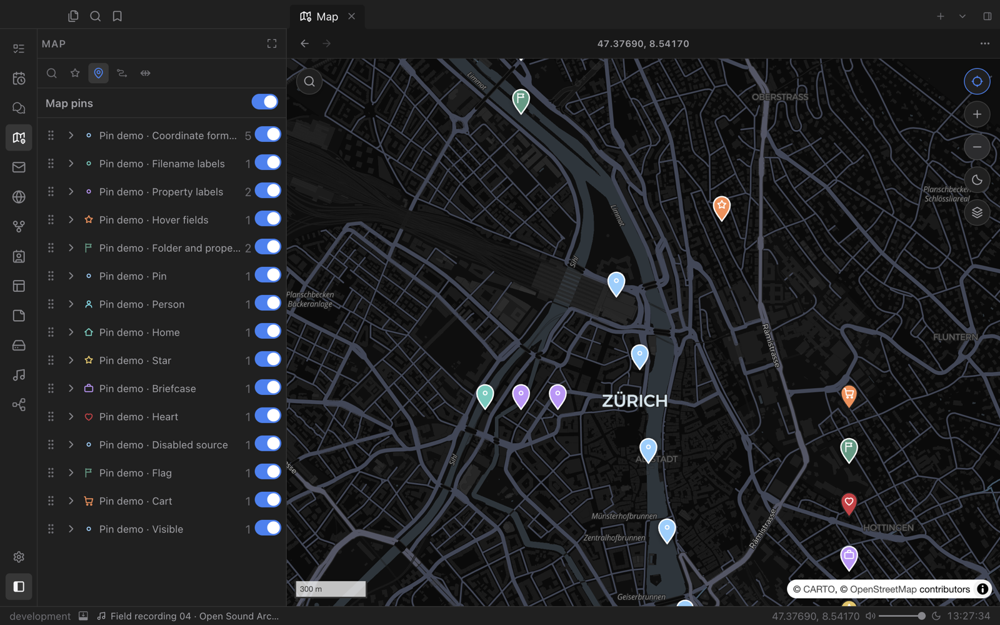
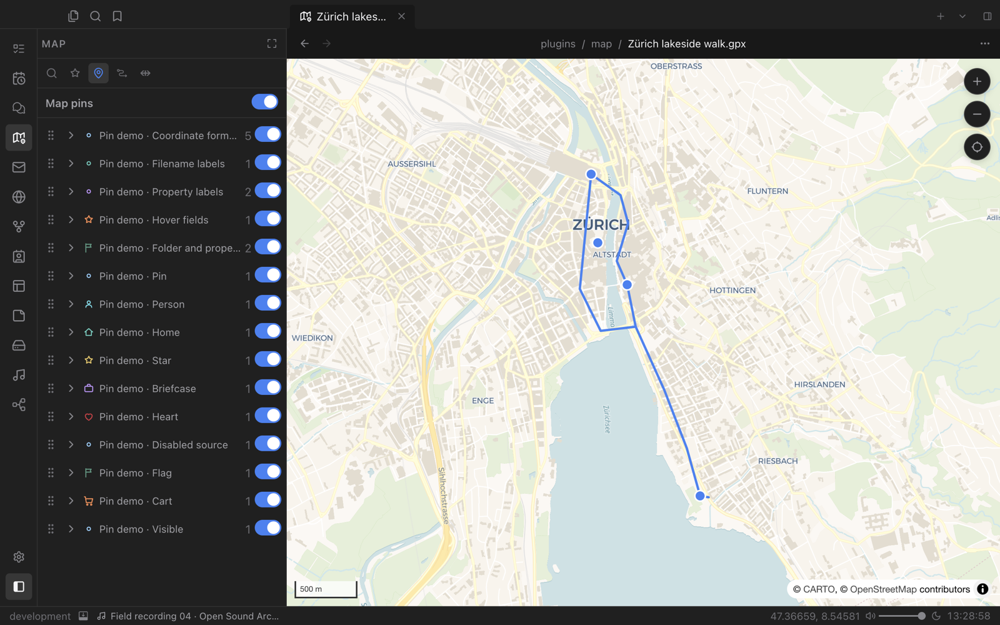
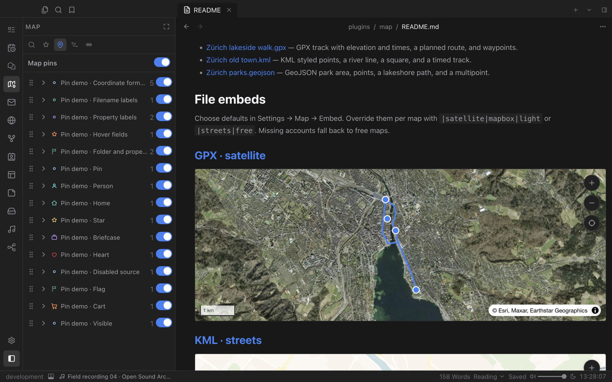

# Map

An interactive map for your places, routes and notes. Pin notes by address or coordinates, plan routes with distance and elevation, open GPX, KML and GeoJSON files, and embed live maps in your notes.

## Notes on the map

Map pins turns notes into places. Point a pin source at a folder and choose whether it reads an address or coordinates from each note's properties. Every source gets its own colour, icon and visibility switch in the sidebar, and hovering a pin shows the fields you choose.

- Bring your own SVG pin icons; they update live when you edit them.
- Save favourite places and routes in the sidebar for quick access.
- Switch the map between light and dark with one click.

## Routes and track files

Open `.gpx`, `.kml` and `.geojson` files directly. Each file gets its own map tab that fits the route automatically, with click-to-inspect details such as distance, climb, elevation and times. Your files are never modified.

The route planner in the right sidebar offers travel modes, distance and travel time, and an elevation profile.

## Maps inside your notes

Embed a track with `![[route.gpx]]` or add a map code block. Embedded maps stay interactive, with drag-to-pan and zoom controls, while ordinary scrolling keeps moving through the note. Choose streets, satellite, navigation or outdoor styles per embed.

Free map providers work out of the box. Optional Mapbox and OpenRouteService connections can be added under Accounts.
